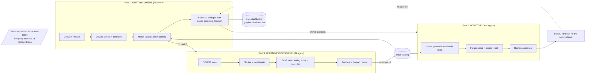
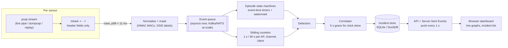
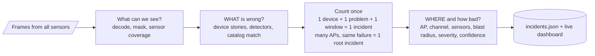
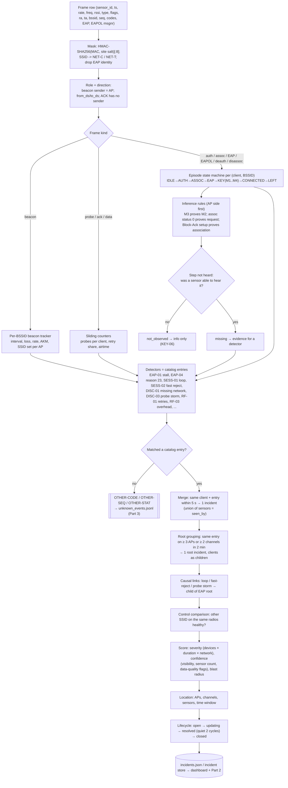
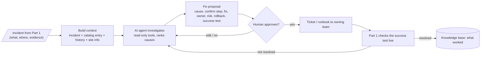
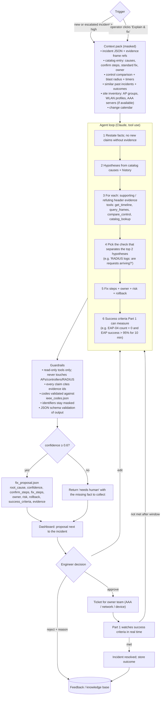
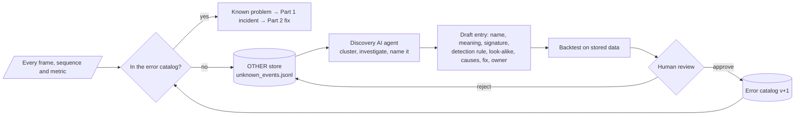
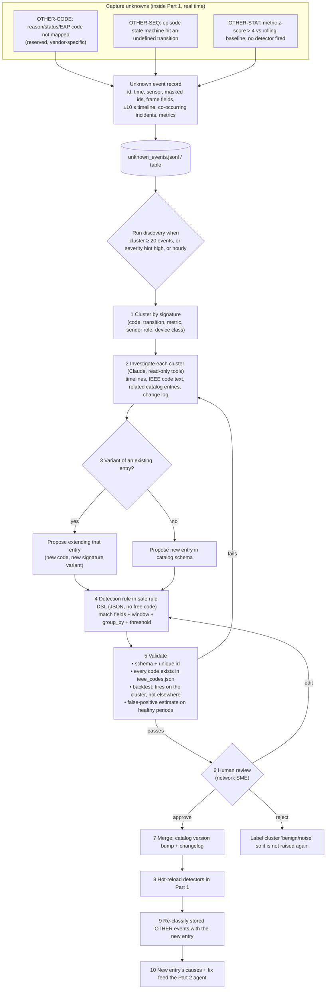

# Airframe flows: Part 1, Part 2, Part 3 (high level and deep level)

Plain version. Renders in VS Code (Markdown Preview Mermaid Support), GitHub, or https://mermaid.live.
The styled version is `v3/flows.html`.

---

## 0. The whole system at a glance

---

## 1. Real-time data path (measured on this laptop)

Measured: 8 sensors at live pace = 571 frames/s, p50 2.8 ms, p99 10.5 ms from pipe to decoded row. The laptop sustains about 15x the live rate (≈ 9,500 frames/s). The site-wide login outage would appear 36 s after the first failed join (first 30 s re-ask on the third AP at t = 47.5 s).

---

## 2. Part 1: find WHAT is wrong and WHERE

### 2a. High level

### 2b. Deep level

---

## 3. Part 2: AI agent that proposes HOW TO FIX

### 3a. High level

### 3b. Deep level

---

## 4. Part 3: catalog of all errors + learning the unknown ones

### 4a. High level

### 4b. Deep level

